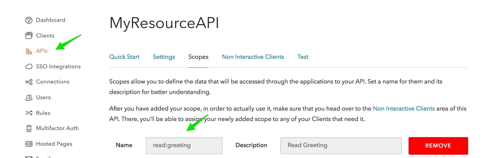

# auth0-spring-security-api-sample-v1

This is a companion sample for the [Auth0 Spring Security API](https://github.com/auth0/auth0-spring-security-api) library.
Please refer to that library and documentation for further information specific to the library itself.

Demonstrates using Auth0 with Spring Boot and Spring Security to create a Java Spring API - JWT Access Token and scope level Authorization.
Meant to be used in conjunction with an Auth0 defined [Resource API](https://auth0.com/docs/api-auth/tutorials/configuring-tenant-for-api-auth). 

## Before Running

- Run
  ```
  mvn install
  ```

- Create an API in Auth0 dashboard

Please see docs [here](https://auth0.com/docs/api-auth/tutorials/configuring-tenant-for-api-auth) for details.

## Configuration

Rename `application.properties.sample` to `application.properties` and configure the following

- `auth0.issuer` with the issuer value of your API obtained from Auth0 Dashboard
- `auth0.audience` with the audience value of your API obtained from Auth0 Dashboard

This will use RS256 by default. If you want HS256 add also `auth0.secret` 

Example configuration populated for RS256:

```
auth0.issuer=https://mytenant.auth0.com/
auth0.audience=https://myresourceapi.com
auth0.algorithm=RS256
```


## Run

Execute the following command

```
mvn spring-boot:run
```

And it will start the resource server so you can hit two endpoints

- http://localhost:8080/greeting: non secured endpoint
- http://localhost:8080/secure/greeting: secured endpoint that needs a bearer token issued by Auth0

By default it only allows access to authenticated users but you can also require the presence of a scope. 
You can do that in `HSSecurityConfig.java` or `RSSecurityConfig` where it has

```java
        http.authorizeRequests()
                .antMatchers("/secure/**").fullyAuthenticated();
```

and change `fullyAuthenticated()` for something like

```
        http.authorizeRequests()
                .antMatchers("/secure/**").hasAuthority("read:greeting");
```

When the user is authorized, all the token scopes are loaded in Spring's `Authentication` object and returned from the method `getAuthorities()`.

> You can use any of the scopes defined in your API, and even request several of them

Here's how a JWT Access Token might look (omitting signature etc):

```
{
  "typ": "JWT",
  "alg": "RS256",
  "kid": "xxxx"
}


{
  "iss": "https://demo-workshop.auth0.com/",
  "sub": "xxxx",
  "aud": "https://resourceapi.com",
  "exp": 1484806334,
  "iat": 1484770334,
  "scope": "read:greeting"
}

```

Note, above the scope `read:greeting` was requested.

And here is how you might call the endpoint using a simple CURL Command:

````
curl -X GET -H "Authorization: Bearer {{JWT ACCESS TOKEN}}" -H "Content-Type: application/json" -H "Cache-Control: no-cache" "http://localhost:8080/secure/greeting"
````

## Setting Scope In Resource API 

Here is a screenshot on how this might look in the Auth0 Dashboard

